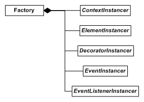

So you've got RmlUi integrated into your application, but how are you meant to use it? This is an overview of the significant concepts and objects at the core of RmlUi.

### Ownership and lifetimes

RmlUi uses smart pointers to declare ownership. For consistency with the library's naming scheme, the following aliases are declared
```cpp
template<typename T> using UniquePtr = std::unique_ptr<T>;
template<typename T> using SharedPtr = std::shared_ptr<T>;
```

All raw pointers are non-owning, never call `delete` on objects returned by the library! The possible exception is when using a custom [instancer](#the-factory-and-instancers) and you have used the `new` operator on the same object previously.

Interfaces created by the user are typically submitted to the library and stored through a non-owning raw-pointer. This means that it is the responsibility of the user to handle the lifetime of the interface. Typically, the interface must stay alive until after the call to `Rml::Shutdown` and then cleaned up afterwards. All relevant functions are commented with their lifetime requirements.

In most cases, non-owning raw pointers are returned by the library. In a few cases however, a unique or shared pointer is returned, thereby giving ownership to the user. The objects can then be moved or copied into the library again. Otherwise their destructors will clean up the object when they go out of scope. 

Since raw pointers are non-owning, their underlying resource may in principle be released at any time. Thus, care must be taken to avoid interacting with a released resource, as this results in undefined behavior. For example, when releasing an element from its parent, all its descendents will be released as well. In turn, all raw pointers to the removed elements are invalidated. Read more about [ownership of elements here](elements.html#ownership-of-elements).

Elements and some other objects can generate an `Rml::ObserverPtr<T>`. An observer pointer can help manage lifetime issues by telling its user that the observed object has been destroyed.
```cpp
Rml::Element* element = document->GetElementById("content");
Rml::ObserverPtr<Rml::Element> observer = element->GetObserverPtr();
// ...
if (observer) {
	// Will only enter if object is still alive.
	observer->SetClass("celebrate", true); 
}
```

### The element hierarchy


#### Element

An element, represented by a `Rml::Element` object, is a single interface element, generally found within a document. When loading a document from an [RML](../rml.html) file, each RML tag will create a single element within the document.

An element is either rectangular in shape or consists of a series of rectangles. Elements are part of a hierarchy, each element having one parent and any number of ordered children. Each child may or may not be positioned within its parent element.

Elements have [RCSS](../rcss.html) properties assigned to them through the [style system](rcss.html). These properties determine the size, layout and graphical representation of the element, as well as any [decorators](decorators.html) on the element.

Elements send [events](events.html) when certain actions are performed on them. The application can subscribe to elements to be notified when an event occurs on that element. All elements send events for mouse actions (`hover`{:.evt}, `click`{:.evt}, `double-click`{:.evt}, etc) and when the input focus changes (`focus`{:.evt}, `blur`{:.evt}). Further events can be sent by derived elements.

The functionality of an element can be extended by deriving from the `Rml::Element` class, (such as with the elements in the [element packaages](element_packages.html)). Applications can derive their own custom elements.

If comparing RmlUi to HTML, a RmlUi element is analogous to a node within an HTML page.

#### Document

A document, represented by a `Rml::ElementDocument` object, is an element itself, and the root of the element hierarchy for a document. A document generally exists within a context. Documents are layered within their context, and can be forced into a specific layer (ie, fixed to the background or foreground).

A RmlUi document is analogous to an HTML page within a web browser.

#### Context

Each context, represented by a `Rml::Context` object, is an independent collection of documents. Each context has its own size and maintains its own input state; this includes mouse cursor position, focus element and hovered elements. Contexts can be updated, rendered and provided with user input independently of each other at the application's discretion.

A RmlUi context is analogous to a single desktop containing several HTML pages, each within their own window.

### Properties and style sheets

Properties are named attributes with a given range of values that are attached to elements. The specification of properties is defined by RmlUi, although new properties can be defined by the application. Each element has a value attached to it for every available property; these values will be the property's default unless explicitly set. Properties influence layout, formatting and decoration of elements.

[Style sheets](rcss.html) contain groups of property declarations and rules to selectively apply these groups to elements within a document. Style sheets are typically contained in a separate file or declared inline in an RML file.

A RCSS property is analogous to a CSS property on an HTML element.

### Computed values

Most built-in properties have a corresponding computed value associated with them. This concept is analogous to CSS computed values, that is, computed values convert any properties to the most basic units possible before layouting can be performed. E.g. length-percentage values are often converted to pixels or percentages. The computed values for a given element is calculated during the `Context::Update` call.

### Decorators

[Decorators](decorators.html) are objects designed to be attached to elements to render arbitrary effects. Several built-in decorators are included with RmlUi, and applications can create their own by deriving from the decorator interface `Rml::Decorator`. Decorator attachment and customisation is built into the property system.

### The factory and instancers

All of RmlUi's objects that are able to be customised (elements, documents, contexts, decorators, events and event listeners) are constructed through the factory `Rml::Factory` with specific instancer types.



Instancers are abstract types that are capable of creating and destroying concrete RmlUi objects. They are described throughout their documentation alongside their respective types. 
